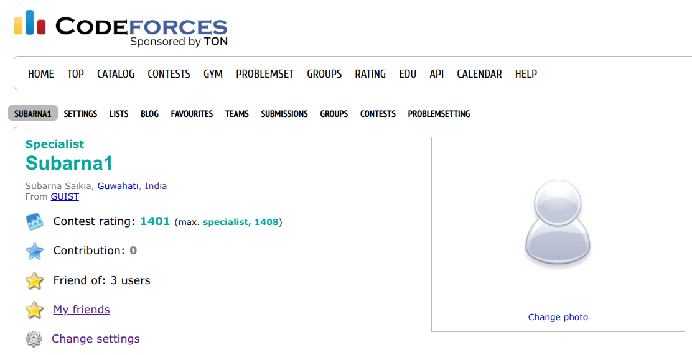
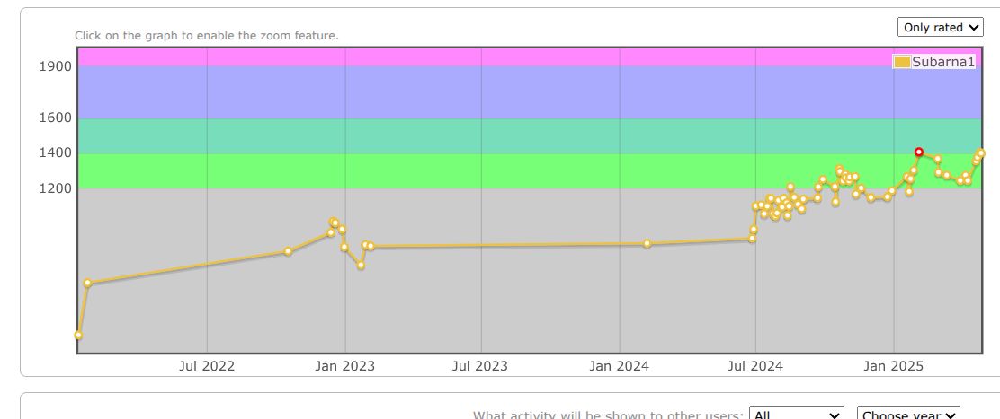
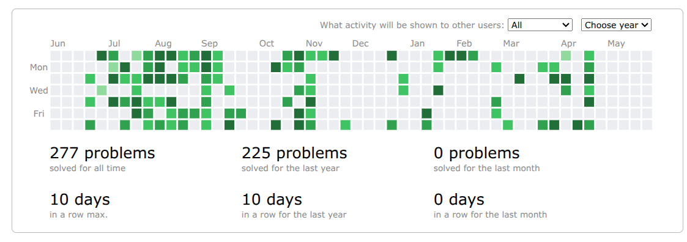
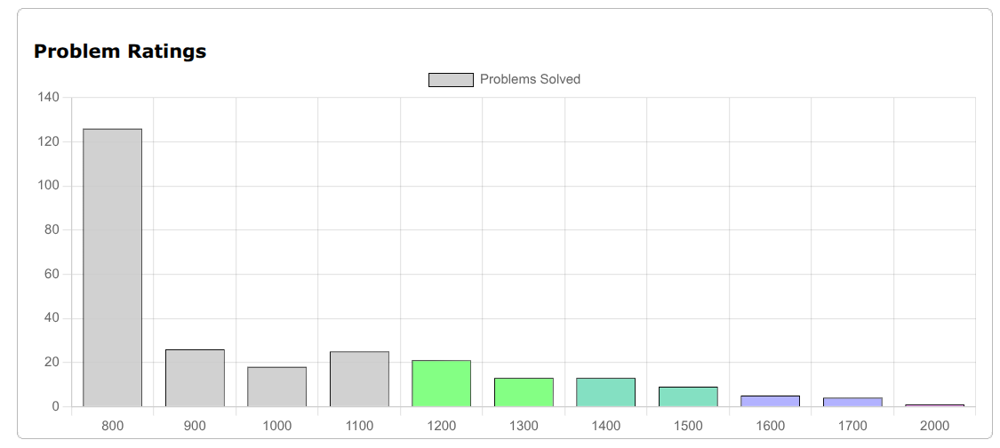
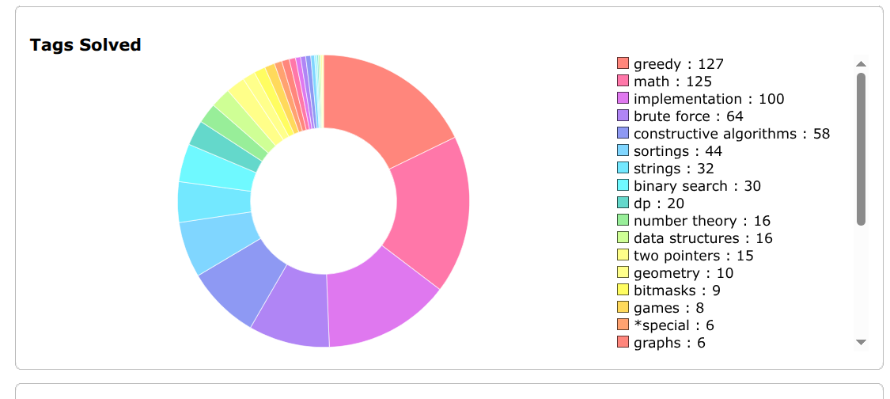

>> This repository contains all problems I solved during my practice time or in contests.

## 🚀 Codeforces Stats

<table>
  <tr>
    <td></td>
    <td></td>
  </tr>
  <tr>
    <td></td>
    <td></td>
  </tr>
<!--   <tr>
    <td colspan="2"></td>
  </tr> -->
</table>

